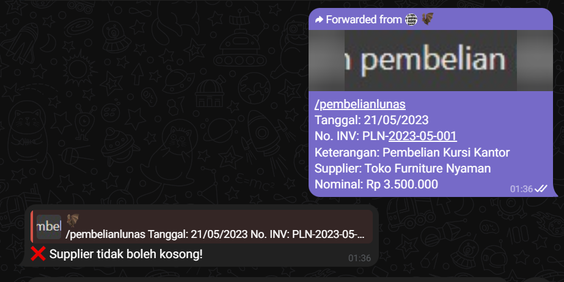
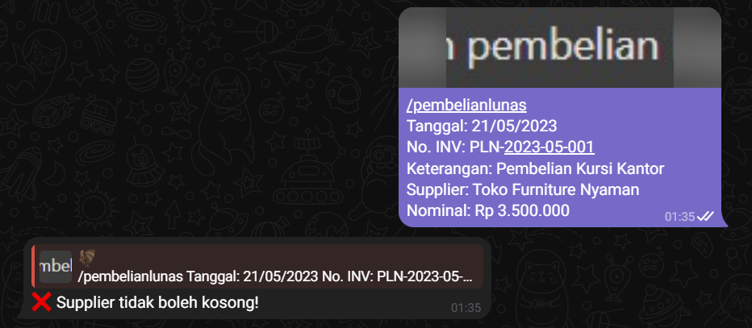

# BOT Telegram Transaksi

Bot Telegram untuk otomatisasi pencatatan transaksi pembelian dan penjualan yang akan menyimpan data ke Google Sheets dan file lampiran ke Google Drive.

## Fitur

- Membaca pesan dari grup Telegram
- Mendeteksi jenis transaksi (pembelian atau penjualan)
- Mengambil data penting dari pesan: Tanggal, Jenis Transaksi, No. Invoice, Keterangan, Nominal, Supplier/Customer
- Menyimpan lampiran (PDF atau gambar) ke Google Drive
- Menyimpan data transaksi ke Google Sheets dalam format jurnal
- Penomoran otomatis untuk transaksi
- Mencatat informasi pengirim dan waktu input
- Hyperlink "Lihat Lampiran" untuk akses cepat ke file yang diunggah
- Pembersihan otomatis baris kosong di spreadsheet
- Format spreadsheet yang rapi dengan header berwarna, kolom dibekukan, dan lebar kolom yang optimal
- Kontrol akses yang membatasi bot hanya dapat digunakan oleh grup dan pengguna tertentu

## Prasyarat

- Node.js
- Akun Telegram
- Bot Telegram (buat melalui BotFather)
- Akun Google dengan akses ke Google Sheets dan Google Drive

## Pengaturan

### 1. Konfigurasi Bot Telegram

1. Buka Telegram dan cari [@BotFather](https://t.me/botfather)
2. Kirim pesan `/newbot` dan ikuti petunjuk untuk membuat bot baru
3. Simpan token bot yang diberikan untuk digunakan nanti
4. Tambahkan bot ke grup Telegram yang akan digunakan

### 2. Konfigurasi Google Cloud Console

1. Buka [Google Cloud Console](https://console.cloud.google.com/)
2. Buat project baru atau gunakan project yang sudah ada
3. Aktifkan API berikut:
   - Google Sheets API
   - Google Drive API
4. Buat Service Account:
   - Buka "IAM & Admin" > "Service Accounts"
   - Klik "Create Service Account"
   - Beri nama service account
   - Berikan peran "Editor" untuk Google Sheets dan Google Drive
   - Klik "Done"
5. Buat kunci JSON untuk service account:
   - Klik service account yang baru dibuat
   - Buka tab "Keys"
   - Klik "Add Key" > "Create new key"
   - Pilih "JSON" dan klik "Create"
   - File JSON akan didownload otomatis
   - Rename file menjadi `credentials.json` dan letakkan di root folder project

### 3. Konfigurasi Google Sheets

1. Buat spreadsheet baru di Google Sheets
2. Bot akan otomatis membuat sheet "Transaksi" dengan header kolom berikut:
   - No (Nomor urut otomatis)
   - Tanggal
   - Jenis Transaksi
   - No. Invoice
   - Keterangan
   - Supplier
   - Customer
   - Nominal
   - Lampiran
   - Pengirim
   - Waktu Input
3. Bagikan spreadsheet dengan service account yang telah dibuat (gunakan email service account)
4. Salin ID spreadsheet (bagian URL antara `/d/` dan `/edit`) untuk digunakan nanti

### 4. Konfigurasi Google Drive

1. Buat folder di Google Drive untuk menyimpan file-file lampiran
2. Bagikan folder dengan service account yang telah dibuat (gunakan email service account)
3. Salin ID folder (bagian URL setelah `folders/`) untuk digunakan nanti

### 5. Konfigurasi Access Control (Kontrol Akses)

Untuk membatasi bot agar hanya dapat digunakan oleh grup dan pengguna tertentu:

1. **Dapatkan ID Grup Telegram**:
   - Tambahkan bot ke grup target
   - Kirim pesan di grup
   - Gunakan bot `@get_id_bot` atau jalankan script `get-chat-id.js` (disertakan dalam repositori)
   - Catat ID grup (format: `-100xxxxxxxxxx`)

2. **Dapatkan ID Pengguna Telegram**:
   - Chat pribadi dengan bot `@userinfobot` atau `@get_id_bot`
   - Catat ID pengguna numerik Anda

3. **Konfigurasi di file `.env`**:
   ```
   ACCESS_CONTROL_ENABLED=true
   ALLOWED_GROUPS=-100123456789,-100987654321
   ALLOWED_USERS=123456789,987654321
   ```

   - `ACCESS_CONTROL_ENABLED`: Set `true` untuk mengaktifkan kontrol akses
   - `ALLOWED_GROUPS`: Daftar ID grup yang diizinkan, dipisahkan koma
   - `ALLOWED_USERS`: Daftar ID pengguna yang diizinkan chat private, dipisahkan koma

### 6. Konfigurasi Aplikasi

1. Clone repositori ini
2. Jalankan `npm install` untuk menginstal dependensi
3. Salin `env.example` ke `.env` dan edit dengan nilai-nilai berikut:
   - `BOT_TOKEN`: Token bot Telegram
   - `SPREADSHEET_ID`: ID Google Spreadsheet
   - `DRIVE_FOLDER_ID`: ID folder Google Drive
   - Pengaturan access control (lihat bagian sebelumnya)
4. Letakkan file `credentials.json` yang telah didownload di root folder project
5. Jalankan bot dengan `npm start`

## Struktur Proyek

```
telegram-bot-transaksi/
├── config/
│   └── index.js                # Konfigurasi aplikasi
├── src/
│   ├── services/
│   │   ├── sheetsService.js    # Layanan Google Sheets
│   │   └── driveService.js     # Layanan Google Drive
│   └── utils/
│       ├── googleAuth.js       # Utilitas autentikasi Google
│       ├── messageParser.js    # Utilitas untuk parsing pesan
│       └── perfOptimizer.js    # Utilitas optimasi performa
├── .env                        # File konfigurasi environment (perlu dibuat)
├── .gitignore                  # File gitignore
├── credentials.json            # Kredensial Google API (perlu dibuat)
├── env.example                 # Contoh file .env
├── credentials.json.example    # Contoh file credentials.json
├── main.js                     # File utama aplikasi
├── package.json                # File konfigurasi npm
└── README.md                   # Dokumentasi
```

## Penggunaan

Di grup Telegram, kirim pesan dengan format berikut:

### Penjualan
```
!penjualan
Tanggal: 30/04/2025
No. INV: INV-203012025
Keterangan: Penjualan Barang
Customer: Budi Hartanto
Nominal: Rp880.000
```
*Lampirkan file jika ada.*

### Pembelian
```
!pembelian
Tanggal: 25/04/2025
No. INV: INV-7347324
Keterangan: Pembelian ATK
Supplier: PT. BINTANG MAKMUR
Nominal: Rp2.170.600
```
*Lampirkan file jika ada.*

### Iklan
```
!iklan
Tanggal: 25/04/2025
No. VA: VA-724535
Keterangan: Iklan Instagram
Supplier: PT. META INDONESIA
Nominal: Rp1.500.000
```
*Lampirkan file jika ada. Transaksi iklan dicatat sebagai transaksi pembelian di spreadsheet.*

### Pelunasan
```
/pelunasan
[nomor invoice/VA]
```
*Lampirkan bukti transfer (file/gambar) yang akan disimpan ke Google Drive dan mengubah status transaksi menjadi "Lunas".*

### Perintah Admin

Bot juga menyediakan beberapa perintah admin:

- `/clean` - Membersihkan baris kosong dari spreadsheet secara manual

## Hasil Pencatatan

Bot akan menyimpan transaksi ke dalam sheet "Transaksi" dengan kolom-kolom berikut:
1. No - Nomor urut otomatis
2. Tanggal - Tanggal transaksi
3. Jenis Transaksi - Penjualan atau Pembelian
4. No. Invoice - Nomor invoice transaksi
5. Keterangan - Keterangan transaksi
6. Supplier - Nama supplier (untuk pembelian)
7. Customer - Nama customer (untuk penjualan)
8. Nominal - Nilai transaksi
9. Lampiran - Hyperlink "Lihat Lampiran" yang mengarah ke file di Google Drive
10. Pengirim - Username atau nama pengguna yang mengirim transaksi
11. Waktu Input - Waktu transaksi diinput

## Fitur Otomatisasi

Bot ini dilengkapi dengan beberapa fitur otomatisasi:

1. **Pembersihan Baris Kosong** - Bot akan secara otomatis membersihkan baris kosong dari spreadsheet:
   - Saat bot pertama kali dijalankan
   - Setiap 24 jam secara terjadwal
   - Secara manual menggunakan perintah `/clean`

2. **Format Spreadsheet** - Saat pertama kali membuat sheet "Transaksi", bot akan:
   - Mengatur lebar kolom secara optimal
   - Membuat header dengan teks bold, dibekukan, dan berwarna latar belakang abu-abu
   - Menyusun layout spreadsheet agar mudah dibaca

## Troubleshooting

### Bot tidak merespons pesan
- Pastikan token bot benar
- Pastikan bot telah ditambahkan ke grup
- Pastikan format pesan sudah benar
- Periksa apakah ID grup atau ID pengguna telah diatur dengan benar di file .env jika menggunakan fitur access control

### Error saat menyimpan ke Google Sheets atau Drive
- Pastikan file `credentials.json` sudah benar
- Pastikan ID spreadsheet dan folder sudah benar
- Pastikan service account memiliki akses ke spreadsheet dan folder

### Masalah dengan Kontrol Akses
- Pastikan ID grup dan ID pengguna yang dimasukkan sudah benar
- Perhatikan format ID grup: `-100xxxxxxxxxx`
- Perlu diperhatikan bahwa ID grup dan ID pengguna harus dalam format string di file .env

### Masalah dengan Baris Kosong
Jika masih terdapat masalah dengan baris kosong, coba jalankan perintah `/clean` di grup Telegram untuk membersihkan spreadsheet secara manual.

## Performa Tinggi

Bot ini dirancang untuk performa tinggi dengan fitur:
- Caching untuk mengurangi API calls berulang
- Batch processing untuk operasi Google Sheets
- Rate limiting untuk mencegah overload API
- Exponential backoff untuk retry operasi gagal
- Optimasi file untuk upload

## Lisensi

ISC 